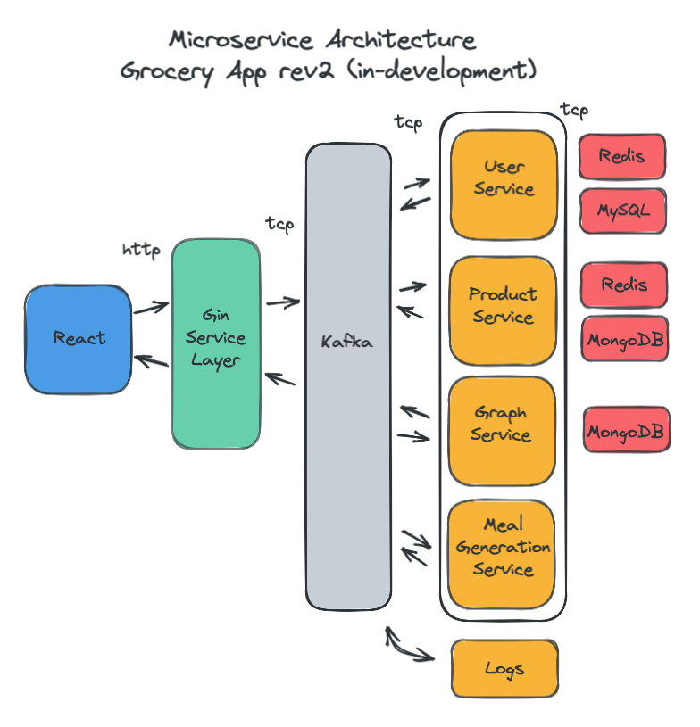

# Microservice Grocery App 

Microservice architecture consisting of React, GoLang, Python, MySQL, MongoDB, Redis, REST, Linux, with deployment using Kubernetes and a version being designed for AWS infrastructure. Currently in developement and subject to revision.

* Web/Frontend: React
* Service Layer: GoLang, Gin, net/http

* User Service: Python, expected to handle user authentication and sessions.
* Product Service: GoLang, product handling. 
* Graph Service: GoLang, generating shortest path to products in grocery store. 
* Meal Generation Service: GoLang, meal generator based on caloric inputs.

